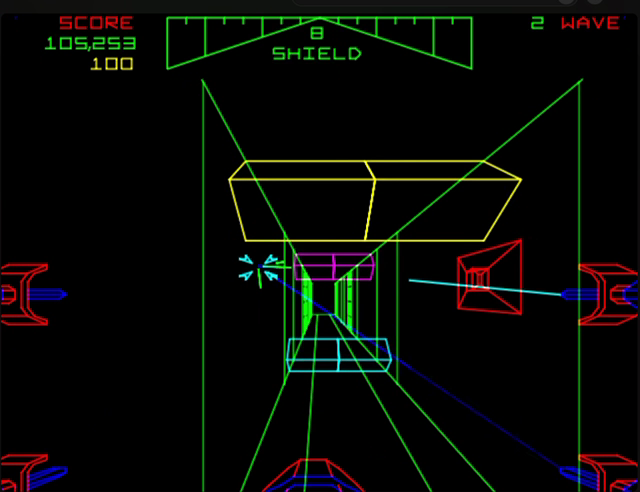
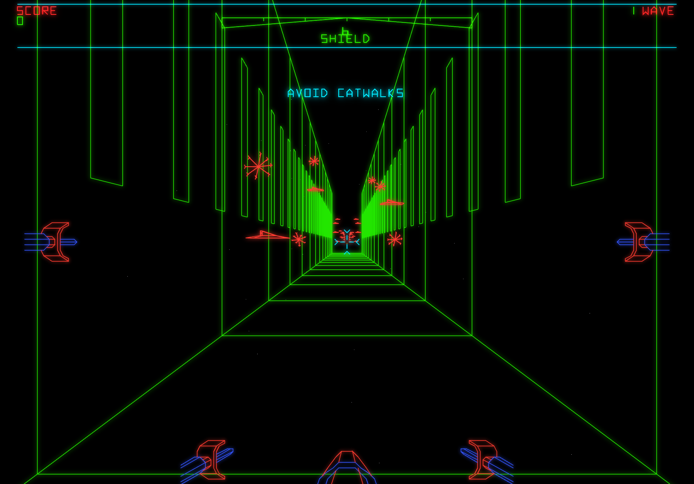
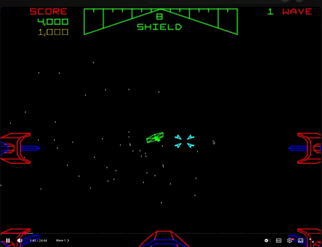
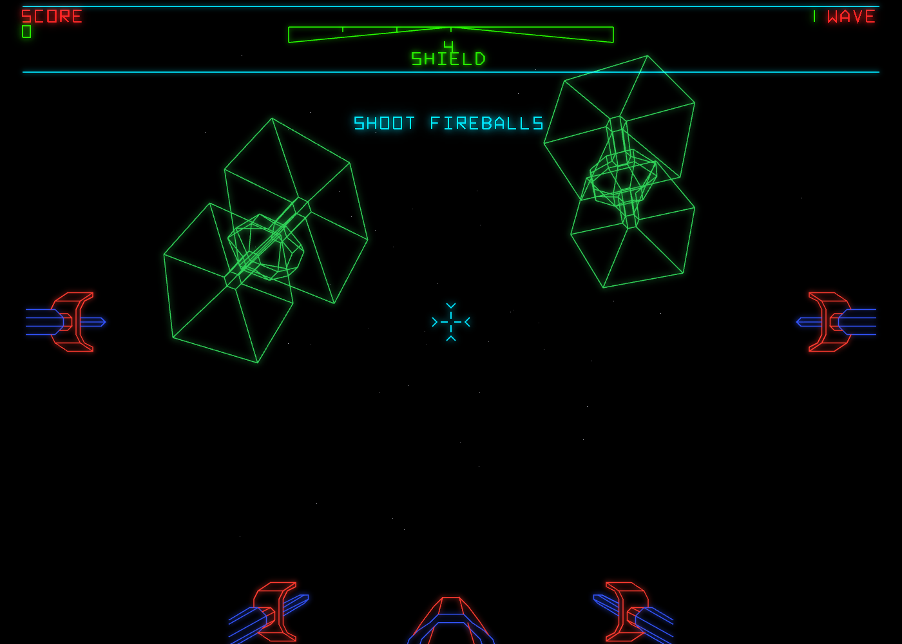
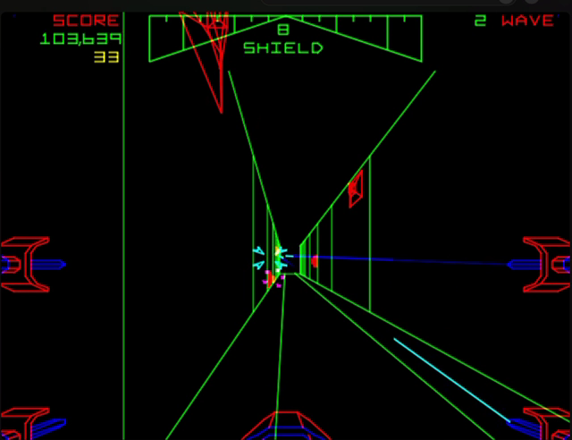
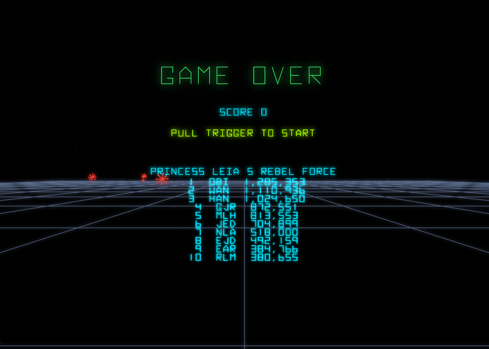

# Star Wars — 3D→2D Projection Fidelity Audit

**Date:** 2026-08-08
**Scope:** the projection/camera pipeline only (not a full primary-source constant sweep).
**Question that prompted it:** the game "feels wrong" — TIEs not closing in, the trench
not reading right, weapons not lining up with the walls and "firing the wrong way."

> **Confidence discipline.** Findings below are tagged **CONFIRMED** (a cited fact in the
> 1983 source *and* our code), **VISUAL** (seen in a side-by-side capture this session), or
> **REPORTED** (in the prompt, but *not* reproduced here — do not act on it as fact yet).
> One correction to an earlier snap judgement is called out explicitly in §4.

---

## 1. Method & ground-truth sources

Three independent sources were read against our code:

| Source | On disk | What it is good for |
|---|---|---|
| Original Atari MACRO-11 source ("Warp Speed") | `~/Projects/star-wars-1983-source-text` (LF) | **The projection authority** — the Math Box micro-program and view setup, with comments. |
| MAME | `~/Projects/mame/src/mame/atari/` | The *hardware primitives* only — see the caveat below. |
| Longplay video | `~/Projects/star-wars-longplay.mov` (6:52) | Visual ground truth per phase. |

### Caveat: MAME does **not** contain the Star Wars projection math

The `mathbox.cpp` device is Battlezone/Red Baron/Tempest. Star Wars' own matrix processor
(`starwars_m.cpp`) implements only the generic primitive `ACC += (A−B)·C` plus a separate
hardware restoring divider; the AVG (`avgdvg.cpp`) is a pure 2‑D deflection integrator
(screen X `+=`, Y inverted; visible area 250×280). **The axis assignments, signs, field of
view and clip all live in the 6809 *vector ROM* — a binary, not source.** So MAME can tell
us *how the divide behaves*, but the actual projection constants come from the original
assembler source, which we have.

Consequence for the original plan: **headless MAME exports are both blocked (no local
Star Wars ROM set) and low-value here.** The longplay + the 1983 source are sufficient and
authoritative for a projection audit.

---

## 2. The authentic projection (CONFIRMED, cited)

From `SWMP.DOC`, `SWMP.MAC`, `WSOBJ.MAC`, `WSMAIN.MAC`, `WSCPU.MAC`:

- **Axes** (`SWMP.DOC:12-13`, `WSCPU.MAC:1174-1177`):
  **X = straight ahead (depth), Y = to the right, Z = up.** `+X` is forward/away; aliens
  spawn far at `X=$7C00` and X *decreases* toward the player (`WSCPU.MAC:1176-1177`).
- **Perspective divide is by the depth axis X** (`SWMP.DOC:180-188`, `SWMP.MAC:497-507`
  `PERS`): `YP = YP·(1/X)` → **screen X**, `ZP = ZP·(1/X)` → **screen Y**. The reciprocal
  `1/X` is a *hardware divide* with a fixed numerator `M.DVN = $200` (`WSMAIN.MAC:530-531`;
  divider regs `WSGLOB.MAC:151-164`), applied by `OBJPNT` (`WSOBJ.MAC:933-943`).
- **Field of view is a symmetric 90° (45° half-angle) on both axes**, and it is literally
  the *clip test*: `|Y| < X` and `|Z| < X` (`WSMAIN.MAC:3606-3645`; starfield mirror
  `WSSTAR.MAC:135-140`). There is **no** separate focal-length constant and **no** per-phase
  FOV change — only the clip generosity differs (tight in the trench, `+512.` elsewhere).
  It is **aspect-independent**: lateral and vertical share the same `< X` bound.
- **World scale:** `$4000 = 1.0` fixed-point (`SWMP.DOC:15`, `WSMAIN.MAC:514-515`), zoom
  always unity (`M.SCL=$4000`, `WSGLOB.MAC:231`); play cube ±`$7CFF` (`WSCPU.MAC:803-809`);
  TIE spawn depth `X=$7C00` (`WSCPU.MAC:1179-1183`).
- **Camera = the player-ship matrix in every phase** (space `VIEW` `WSMAIN.MAC:2979`; surface
  `VEWGD` `:3074`; trench `VEWBS` `:3163` — all download the Ship‑1 unit-vector matrix).
- **Weapons fire straight ahead (+X)**, to a point `$7000` downrange, offset laterally/
  vertically by `7/8·site` so the beam converges on the crosshair (`WSLAZR.MAC:417-432`); the
  "site" is the yoke position directly (`WSGLOB.MAC:449-450`, `WSLAZR.MAC:114-121`).
  ⚠ `ST.UX/UY/UZ` are the **starfield drift vector**, *not* ship attitude (`WSMAIN.MAC:2245-2287`).

---

## 3. Our projection (CONFIRMED, cited)

From `src/shared/math3d.ts`, `plugins/star-wars/src/core/gameRules.ts`,
`plugins/star-wars/src/shell/render.ts`:

- **OpenGL right-handed**, camera looks down **−Z** (`math3d.ts:20,110-119`): forward = −Z,
  **+X = right, +Y = up**, perspective **divide by −Z** (`transform` divides by `w = −z`,
  `math3d.ts:46-54`).
- **`FOV_Y = π/3` = 60° vertical** (`gameRules.ts:14`), horizontal = `2·atan(tan30°·aspect)`
  ≈ **78° at 16:10** — i.e. **narrower than the cabinet, anisotropic, and aspect-dependent**,
  where the cabinet is a fixed symmetric 90°.
- **Per-model axis-swap hacks** bridge each ROM model into the OpenGL frame one at a time —
  `SURFACE_ORIENT` (`render.ts:164`), `TOWER_ORIENT`/`GROUND_MODEL_SCALE` (`:204-226`),
  `PORT_ORIENT` (`:193`), `TIE_ORIENT` (`:239`) — instead of one world→eye remap of the
  cabinet's native (X‑fwd, Y‑right, Z‑up) basis. The comments themselves state the mapping
  they undo: *"The ROM's up-axis is Z … ours is Y. This maps (x, y, z) → (x, z, -y)."*

### The divergence, at a glance

| Property | Cabinet (authentic) | Ours |
|---|---|---|
| Depth / divide axis | **X**, `screen ∝ lateral/X` | **−Z**, `screen ∝ lateral/(−Z)` |
| Basis | native X‑fwd, Y‑right, Z‑up | OpenGL −Z‑fwd **+ per-model rotations** |
| Field of view | **symmetric 90°**, aspect‑independent | 60° V / ~78° H, **anisotropic & aspect‑dependent** |
| Numerator / scale | fixed `$200`, unity zoom, `$4000=1.0` | `f = 1/tan(30°)`, model units "1:1" but placements retuned |

---

## 4. Symptom → cause, per phase

### Trench — **CORRECTION to an earlier read**

My first pass called our trench "a narrow central slot." **That was wrong** — it came from
tiny scene-sheet *thumbnails*. The **live** trench frames near-full-screen and its
perspective convergence is broadly right. The real gaps are **content**, not framing:
no yellow catwalk *bridges* spanning the corridor, no wall-mounted turret *cubes*, and an
over-dense green vertical-rib "spray" piling up at the vanishing point.

| Cabinet | Ours (live) |
|---|---|
|  |  |

*Status: framing **VISUAL-ok**; content gaps **VISUAL**.*

### Space (TIEs)

Our TIEs render *large* but sit parked in the upper corners; the cabinet's approach along
the centre axis (small → growing, converging on the reticle) is the behaviour to match.
So "not close enough" reads more as **wrong approach geometry/positioning** than as raw
scale. Space is the least-wrong phase.

| Cabinet | Ours |
|---|---|
|  |  |

*Status: **VISUAL** (positioning differs); TIE flight model is a separate axis (see the
existing TIE-divergence notes).*

### Surface

Our ground reads as a sparse blue grid with a high horizon; the cabinet's is a dense green
convergence full of towers. (Our capture below still carries a game-over overlay — the dev
phase-jump depleted lives — but the receding grid is visible behind it.)

| Cabinet | Ours (grid behind game-over overlay) |
|---|---|
|  |  |

*Status: **VISUAL** (density/horizon differ).*

### "Weapons don't line up with the walls" / "firing the wrong way" — **RESOLVED (not a projection bug)**

The user clarified: it is the **TRENCH WALL GUNS** firing wrong, not the player laser, and
"the bullets outrun the player." This turned out to have **nothing to do with the projection
lens** — it is a frame-consistency bug in the trench enemy fire:

- The trench models the pilot's forward flight as the world scrolling toward a fixed cockpit
  at `TRENCH_SCROLL_SPEED` (~15,750 u/s). Walls, obstacles and the exhaust port all ride that
  scroll (`sim.ts` stepTrench). **Enemy fireballs did not** — they were advanced only by their
  own `ENEMY_SHOT_SPEED` (~300 u/s), so a shot crept forward while the world rushed past 50×
  faster. The player outran the bullet and it read on screen as receding downrange.
- **Fix (this branch):** wall-gun shots are spawned with a closing velocity that rides the
  scroll in depth and **leads** the ship laterally (`gameRules.trenchGunFireVelocity`), so they
  approach the cockpit *with* the world and still strike an off-centre pilot. Because that
  closing is fast (~262 u/frame > the 160 u cockpit sphere), the cockpit hit was made a **swept**
  test (`gameRules.sweptCollides`) to avoid tunnelling.
- Tests: `tests/core/trench-fire-scroll-carry.test.ts` (RED→GREEN); the whole star-wars suite
  (2361) stays green.

The projection-lens findings in §2–§3 remain valid, separate future work — they were not the
cause of this particular symptom.

---

## 5. Root-cause thesis

The shared **projection lens is not the cabinet's**, and because the lens is wrong, the
per-scene placement/scale constants were **hand-tuned to compensate** against it. They no
longer cohere: models are "raw ROM units 1:1," yet `SPAWN_DISTANCE = 1200`, `FOV_Y = 60°`,
trench walls at `±0x400`, camera height `128`… each fudged against a lens that isn't the
machine's. This is the classic "everything calibrated to the wrong base" trap: fix one
constant in isolation and three others drift.

**The lens is the timebase-equivalent global here — it must be corrected first**, or every
later per-object placement re-bakes the wrong base.

---

## 6. Recommendation

**Unify on the authentic lens**, then re-derive placements from ROM constants:

1. A single projection that matches the cabinet: **symmetric ~90° FOV**, **divide by the
   depth axis**, **aspect handled the cabinet way** (both axes bounded by depth, not by
   `w/h`). Decide one world convention — either adopt native (X‑fwd, Y‑right, Z‑up) or a
   *single* clean world→eye remap — and **retire the per-model `*_ORIENT` hacks**.
2. Re-derive `SPAWN_DISTANCE`, trench width/eye-height, surface seat, and TIE approach from
   the ROM constants (`$7C00`, `$4000=1.0`, `$7000`) rather than per-scene fudge.
3. Confirm the aim/wall correspondence and firing direction by **live playtest** (the two
   REPORTED symptoms) once the lens is in.

**Blast radius (be honest):** this touches the `math3d` / `render` / `gameRules` seam plus
many tuned constants and the tests that pin them (camera-MVP, projection invariants, per-phase
placement). It should be TDD'd against new projection invariants derived from §2, and staged
so the lens lands first and placements follow.

---

## 7. Open items / not yet verified

- Trench wall-gun fire direction/speed — **RESOLVED** this branch (see §4); not a projection bug.
- Surface turret fire uses the same shared `advance()` path — worth checking it rides
  `surfaceScrollZ` the same way (out of scope here; the user reported only the trench).
- The dev phase-jump (`8`→surface, `9`→trench from a fresh load) intermittently blanked the
  page during capture; worth a look independent of this audit.
- Exact target FOV: the cabinet clip is `|lateral| < depth` (≈90°). Whether to reproduce it
  as a true 90° frustum or match the *observed* on-screen scale of the longplay is a tuning
  call to make during the fix.

---

*Assets: `assets/projection-audit-2026-08-08/` (cabinet frames from the longplay; our renders
from the 5290 dev server). Cabinet space/surface/trench = longplay ~0:60 / ~3:36 / ~3:54.*
